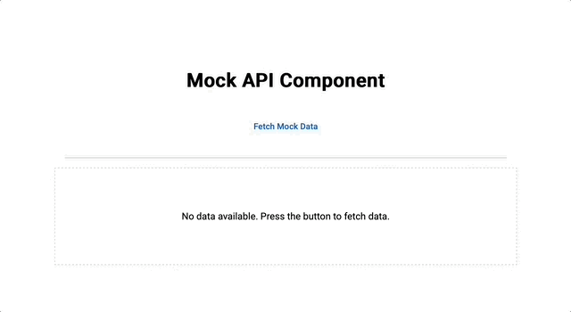

# AngularBinaryRainLoader

This project was generated using [Angular CLI](https://github.com/angular/angular-cli) version 19.0.6.

You can get full details about the implementation in my article: https://codebaseit.com/building-and-integrating-a-binary-rain-loader-in-angular/



## Development server

To start a local development server, run:

```bash
ng serve
```

Once the server is running, open your browser and navigate to `http://localhost:4200/`. The application will automatically reload whenever you modify any of the source files.

## Code scaffolding

Angular CLI includes powerful code scaffolding tools. To generate a new component, run:

```bash
ng generate component component-name
```

For a complete list of available schematics (such as `components`, `directives`, or `pipes`), run:

```bash
ng generate --help
```

## Building

To build the project run:

```bash
ng build
```

This will compile your project and store the build artifacts in the `dist/` directory. By default, the production build optimizes your application for performance and speed.
